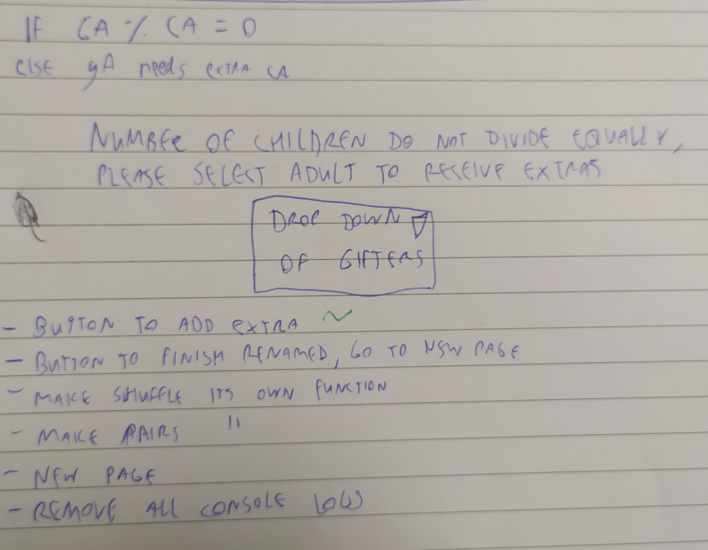

# Secret Santa picker

Choosing website for busy groups

View the live site [here](https://daveguthib.github.io/Project-Portfolio-2/) 

## Features
---

## Index page
- Website will accept a list of names into textboxes, randomise them, assign each gifter a giftee
- Will allow easy navigation between all the parts of the website on devices of any size.
- Reveal button for after the results have been calculated to add some "theatre" to the revealing

## Existing features

- Responsive design
- Colour scheme themed to the subject matter

## Future features

- Additional level of adding children to list, who will only be giftees, and never gifters

## Design

Before coding commenced the assumed structure of the code was plotted out in a more ambitious way than the final design. At this point in the planning an additional feature of allowing a second group of giftees to be added who were children of the gifters. 

The code logic would have included assigning which children "belonged" to which gifter, so that they would not get their own child in the draw. This feature was later dropped.

Some additional logic for dealing with potential errors introduced by the child functionality. If the modulus of the gifterArray and the childArray was 0, that meant the numbers divided down evenly and no further action would need to be taken.

If not an error message would flag that some gifters would need to be assigned more or less children. Resolving this logic was part of why the feature was dropped.

Also featured is a to-do list at this point in the project.

## Testing

At the very start of the project, rather than code the full array and secret santa output, in order to test the connectivity between the textboxes and the javascript, it was coded to simply return one random name from the names entered. This is what that looked like.

Functionality was added to flag an error message in the console if less than two names were entered. This didn't prevent the prototype code from outputting the random name anyway.

At the beginning of the testing, the gifter/giftee array was just output in a console log, here is what it looked like when it was correctly returning the desired values.

In order to speedily and easily populate the text fields with full names, a script was written in Keepass, an open source password manager software.

It enters 12 pre-written names, and presses tab in between them.

At a point in the testing, the reveal button would only repeat the first entry in the field (in this case "Lo-pan") rather than continuing to reveal new giftees from the array (in this case "Gandalf the Grey") as revealed by the console log.

At a point in the testing, the error message intended to prevent less than two names from being entered was incorrectly called when sufficient names were entered. This is because an onclick event was incorrectly defined to occur on ANY click (in this case, the clear button), as opposed to when it was required.

### CSS

CSS was validated via the W3C Jigsaw CSS Validation Service with no errors

### Javascript

A number of errors were flagged by the Jshint validator and resolved

### Lighthouse Performance Testing

The website was tested via Lighthouse Performance test and received the following ratings

## References

